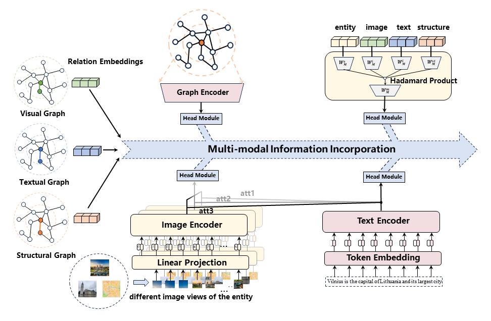
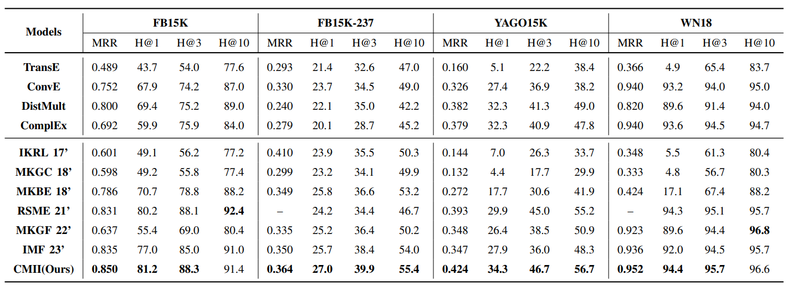

This is the implementation of our paper "Enhancing Knowledge Graph Completion through Comprehensive Multimodal Information Incorporation".



The task of knowledge graph completion involves uncovering hidden patterns and rules in data to identify potential missing triplets in the graph. In recent years, multimodal knowledge has been introduced to enhance the performance of knowledge graph completion. However, existing methods suffer from a lack of comprehensive exploration and deep utilization of multimodal knowledge, which hinders the discovery of more complex node connections and results in a bottleneck in improving link prediction performance. In this paper, we propose a Comprehensive Multimodal Information Incorporation (CMII) Algorithm to comprehensively utilize multimodal knowledge from three aspects. Specifically, we propose a feature enhancement head-based multimodal information incorporation method, which enables the retention of initial features while learning task-related information. Moreover, we present an innovative method for relation extraction from multi-level unimodal knowledge graphs, which allows us to capture the underlying relationships between entities in a more comprehensive way. Additionally, we introduce a low-rank multi-order multimodal feature fusion module to extract complex interaction information between modalities. Extensive experimental results on four datasets demonstrate the effectiveness of CMII compared with existing state-of-the-art methods.


## Requirements

```python
pytorch==1.13.0
numpy==1.25.0
h5py==2.10.0
selenium==2.48.0
urllib==2.0.3
pillow==9.4.0
tqdm==4.62.3
```

## Usage

#### Datasets

The datasets you can download [here](https://drive.google.com/drive/folders/1bz5FIeYPW8lWukl5Iltks5WXuo81gpAr?usp=drive_link).

If you want to obtain a complete set of entity images, please use the image crawling code we provided:`./utils/crawl.py`.

#### Model Training

```python
python learn.py
```

The hyperparameters are set in the `config.py` file.


## Results




## Citation

If you use source codes included in this toolkit in your work, please cite the following paper. The bibtex are listed below:
